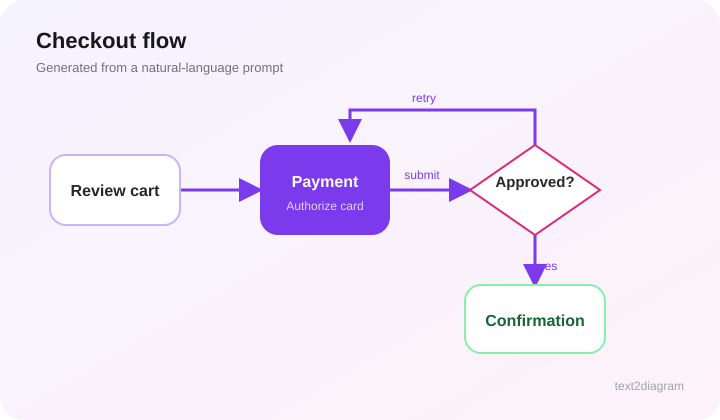
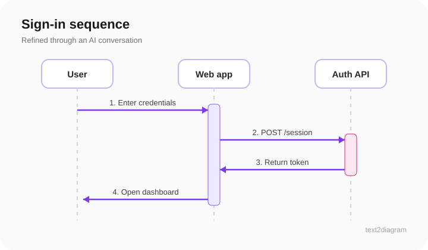
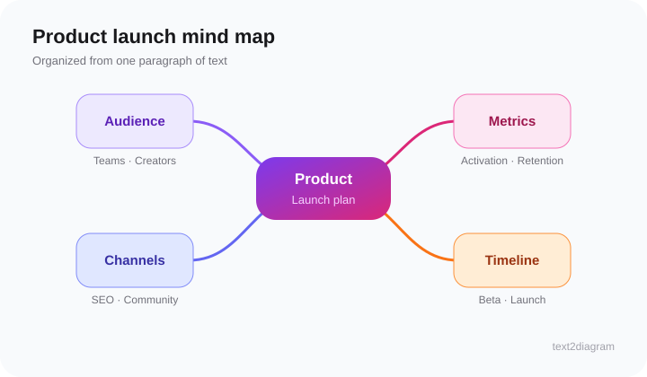

# text2diagram

Turn ideas into editable diagrams by describing them in natural language or chatting with AI.

**Try it free:** [text2everything.vip](https://text2everything.vip)

text2diagram can generate flowcharts, sequence diagrams, ER diagrams, mind maps, state diagrams, class diagrams, and Gantt charts. The output stays editable and can be exported as SVG, PNG, Markdown, or OPML.

## Examples

| Flowchart | Sequence diagram | Mind map |
| --- | --- | --- |
|  |  |  |

## Feedback and support

This repository is the public issue tracker for [text2diagram](https://text2everything.vip). The application source code is maintained separately.

- [Report a bug](https://github.com/diaozxin007/text2diagram/issues/new?labels=bug)
- [Request a feature](https://github.com/diaozxin007/text2diagram/issues/new?labels=enhancement)
- [Browse existing issues](https://github.com/diaozxin007/text2diagram/issues)

Please avoid including API keys, passwords, personal data, or other sensitive information in public issues.
